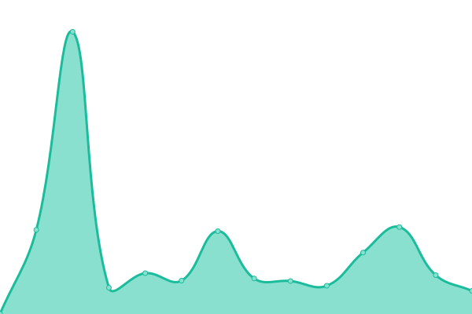
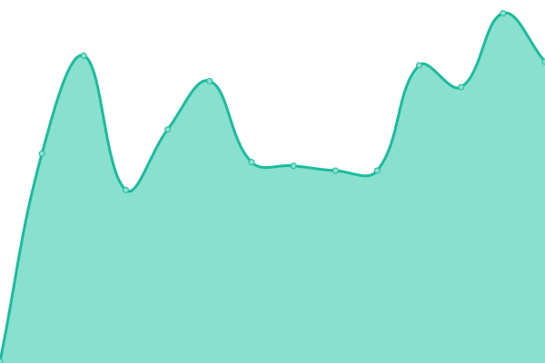
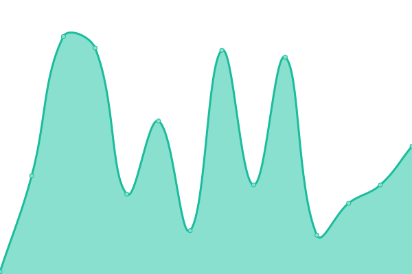
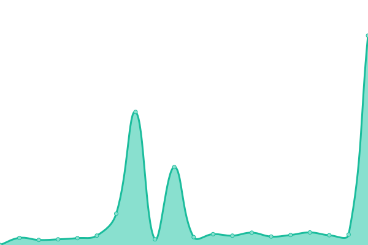
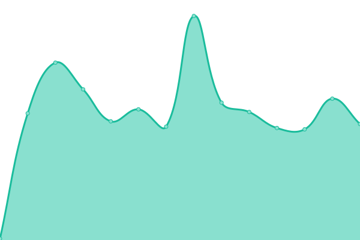

# [📈 Live Status](https://viespirkiu-grupe.github.io/status): <!--live status--> **🟩 All systems operational**

This repository contains the open-source uptime monitor and status page for [Viešpirkiai](https://viespirkiai.top), powered by [Upptime](https://github.com/upptime/upptime).

With [Upptime](https://upptime.js.org), you can get your own unlimited and free uptime monitor and status page, powered entirely by a GitHub repository. We use [Issues](https://github.com/viespirkiu-grupe/status/issues) as incident reports, [Actions](https://github.com/viespirkiu-grupe/status/actions) as uptime monitors, and [Pages](https://viespirkiu-grupe.github.io/status) for the status page.

<!--start: status pages-->
<!-- This summary is generated by Upptime (https://github.com/upptime/upptime) -->
<!-- Do not edit this manually, your changes will be overwritten -->
<!-- prettier-ignore -->
| URL | Status | History | Response Time | Uptime |
| --- | ------ | ------- | ------------- | ------ |
|  [Viešpirkiai](https://viespirkiai.top) | 🟩 Up | [viespirkiai.yml](https://github.com/Viespirkiu-grupe/status/commits/HEAD/history/viespirkiai.yml) | 

 569ms
     
 | 

<a href="https://status.viespirkiai.top/history/viespirkiai">100.00%</a>
    

|  [Failai](https://failai.viespirkiai.top) | 🟩 Up | [failai.yml](https://github.com/Viespirkiu-grupe/status/commits/HEAD/history/failai.yml) | 

 265ms
     
 | 

<a href="https://status.viespirkiai.top/history/failai">100.00%</a>
    

|  [CVPP](https://cvpp.eviesiejipirkimai.lt) | 🟩 Up | [cvpp.yml](https://github.com/Viespirkiu-grupe/status/commits/HEAD/history/cvpp.yml) | 

 192ms
     
 | 

<a href="https://status.viespirkiai.top/history/cvpp">100.00%</a>
    

|  [CVP IS](https://viesiejipirkimai.lt) | 🟩 Up | [cvp-is.yml](https://github.com/Viespirkiu-grupe/status/commits/HEAD/history/cvp-is.yml) | 

 76ms
     
 | 

<a href="https://status.viespirkiai.top/history/cvp-is">100.00%</a>
    

|  [CVP IS (sena-1)](https://eviesiejipirkimai.lt) | 🟩 Up | [cvp-is-sena-1.yml](https://github.com/Viespirkiu-grupe/status/commits/HEAD/history/cvp-is-sena-1.yml) | 

 138ms
     
 | 

<a href="https://status.viespirkiai.top/history/cvp-is-sena-1">100.00%</a>
    

|  [CVP IS (sena-2)](https://pirkimai.eviesiejipirkimai.lt) | 🟩 Up | [cvp-is-sena-2.yml](https://github.com/Viespirkiu-grupe/status/commits/HEAD/history/cvp-is-sena-2.yml) | 

 112ms
     
 | 

<a href="https://status.viespirkiai.top/history/cvp-is-sena-2">100.00%</a>
    

|  [VPT](https://vpt.lrv.lt) | 🟩 Up | [vpt.yml](https://github.com/Viespirkiu-grupe/status/commits/HEAD/history/vpt.yml) | 

 92ms
     
 | 

<a href="https://status.viespirkiai.top/history/vpt">100.00%</a>
    

|  [TED](https://ted.europa.eu) | 🟩 Up | [ted.yml](https://github.com/Viespirkiu-grupe/status/commits/HEAD/history/ted.yml) | 

 95ms
     
 | 

<a href="https://status.viespirkiai.top/history/ted">100.00%</a>
    

<!--end: status pages-->

[**Visit our status website →**](https://viespirkiu-grupe.github.io/status)

## 📄 License

- Powered by: [Upptime](https://github.com/upptime/upptime)
- Code: [MIT](./LICENSE) © [Anand Chowdhary](https://anandchowdhary.com), supported by [Pabio](https://pabio.com)
- Data in the `./history` directory: [Open Database License](https://opendatacommons.org/licenses/odbl/1-0/)
